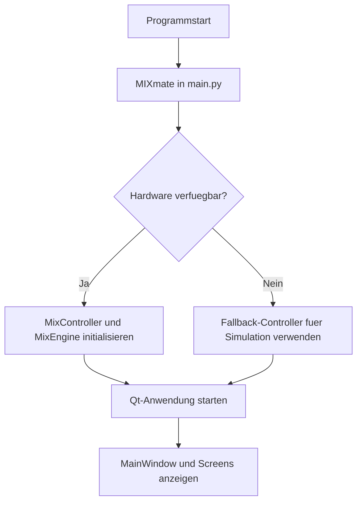
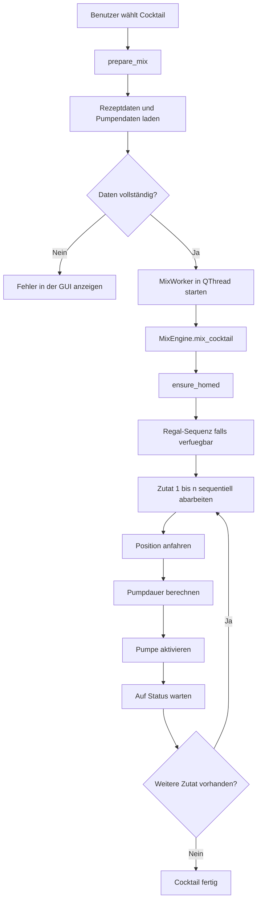
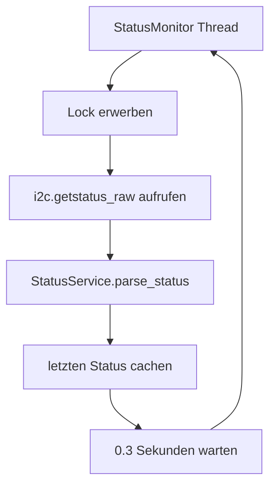

# MIXmate: Ausfuehrliche technische Programmerkennung

## Einleitung

Das vorliegende Programm mit dem Namen MIXmate dient der Steuerung einer automatisierten Cocktail-Mischanlage. Aus technischer Sicht verbindet es eine grafische Benutzeroberfläche, eine relationale SQLite-Datenbank, mehrere Controller- und Serviceschichten sowie eine direkte I2C-Kommunikation mit angeschlossener Hardware. Das System ist so aufgebaut, dass Rezeptdaten, Pumpenkonfigurationen und Maschinenparameter dauerhaft gespeichert werden, während die eigentliche Laufzeitlogik von einer zentralen Ablaufkomponente koordiniert wird. Diese zentrale Komponente ist die `MixEngine`, die in der Datei `Services/mix_engine.py` implementiert ist.

Das Programm verfolgt dabei nicht nur das Ziel, Cocktails aus einer Datenbank auszuwählen und auszugeben, sondern auch den gesamten physischen Ablauf einer realen Mischanlage sicher zu steuern. Dazu gehoeren die Referenzfahrt des Schlittens, die Ueberwachung des aktuellen Maschinenstatus, die Positionierung vor einzelnen Pumpen, die Berechnung der benoetigten Pumpdauer, die Uebergabe eines Glases aus einem Regalmodul sowie die Rueckmeldung an die Benutzeroberfläche. Gerade diese Verbindung aus Datenhaltung, Benutzerinteraktion, physischer Hardwaresteuerung und Fehlerbehandlung macht den technischen Kern des Programms aus.

Im Folgenden wird deshalb im Stil einer technischen Abschlussarbeit erklärt, wie das Programm aufgebaut ist, welche Daten es verarbeitet, wie zentrale Berechnungen vorgenommen werden, wie die `MixEngine` arbeitet, wie die Statusabfrage umgesetzt wurde und welche Rolle das Threading fuer einen stabilen und reaktionsfähigen Betrieb spielt. Kurze Codezitate werden an den passenden Stellen eingefuegt. Dabei wird jeweils angegeben, aus welcher Datei das jeweilige Zitat stammt.

## Zielsetzung und Grundidee des Programms

Die Grundidee von MIXmate besteht darin, dass ein Benutzer ueber eine Qt-basierte Oberfläche einen Cocktail auswählt, woraufhin die Software alle dafuer benoetigten Informationen aus der Datenbank liest und in konkrete Hardwarebefehle uebersetzt. Diese Hardwarebefehle werden ueber den I2C-Bus an einen Mixer-Controller und optional an einen Regal-Controller gesendet. Der Mixer-Controller steuert den Schlitten und die Pumpen, während der Regal-Controller fuer den Transport eines Glases zwischen verschiedenen Ebenen und dem Mixer zuständig ist.

Das Programm ist damit kein reines Verwaltungswerkzeug, sondern eine vollständige Ablaufsteuerung fuer eine Maschine. Die Datenbank beschreibt, was gemischt werden soll. Die Hardwaremodule setzen um, wie es gemischt wird. Dazwischen liegt eine Logikschicht, die den Ablauf sicher und nachvollziehbar orchestriert.

Ein zentrales Merkmal ist, dass das Programm auch ohne echte Hardware betrieben werden kann. Wenn die Initialisierung der I2C-Schnittstellen fehlschlägt, wechselt das System in einen Hardware-losen Modus. In diesem Fall werden Befehle nicht an reale Hardware gesendet, sondern simuliert und in einem Trace-Service protokolliert. Dieser Ansatz ist insbesondere fuer Entwicklung, Tests und Demonstrationen auf einem normalen Laptop wichtig.

## Architektonischer Gesamtaufbau

Die Software folgt einer relativ klaren Schichtenstruktur. Diese Schichten sind nicht vollkommen formal im Sinne eines strengen Architekturpatterns getrennt, aber die Rollen der Komponenten sind deutlich erkennbar.

An erster Stelle steht die Einstiegsebene. Sie befindet sich in `main.py` und ist fuer den Start des Programms zuständig. Dort werden die Controller erzeugt und die Entscheidung getroffen, ob mit echter Hardware oder im Fallback-Modus gearbeitet wird. An zweiter Stelle steht die View-Ebene unter `View/qt/`. Sie enthält die grafische Benutzeroberfläche, also die einzelnen Screens fuer Start, Cocktailauswahl, Statusansicht, Kalibrierung und Administration. Die dritte Ebene bilden die Controller unter `Controller/`. Sie stellen die Verbindung zwischen Benutzeroberfläche und Fachlogik her. Die vierte Ebene bilden die Services unter `Services/`. In dieser Schicht liegt die eigentliche Ablaufsteuerung. Hier befinden sich insbesondere die `MixEngine`, die Statusverarbeitung und die Kalibrierungslogik. Die unterste Ebene bilden schliesslich die Datenmodelle in `Model/` sowie die Hardwaremodule in `Hardware/`.

Bereits an dieser Struktur wird deutlich, dass das Programm zwei sehr unterschiedliche Problemklassen gleichzeitig loest. Einerseits muss es klassische Verwaltungsaufgaben erledigen, etwa das Speichern von Rezepten, Zutaten und Pumpendaten. Andererseits muss es zeitkritische Hardwareabläufe koordinieren. Dass diese beiden Bereiche getrennt behandelt werden, ist fuer die Wartbarkeit des Programms von zentraler Bedeutung.

## Programmstart und Initialisierung

Der Einstiegspunkt des Programms ist die Datei `main.py`. Dort wird in der Klasse `MIXmate` die Grundkonfiguration des Programms aufgebaut. Der wesentliche Punkt ist, dass zunächst versucht wird, die echte Hardwareumgebung zu initialisieren. Gelingt dies nicht, wird automatisch auf einen Software-Fallback umgeschaltet.

Ein zentrales Zitat aus `main.py` lautet:

```python
self.mix_controller = MixController(db_path=db_path)
self.pump_controller = PumpController(self.mix_controller.engine, db_path=db_path)
```

Dieses Zitat zeigt, dass der `PumpController` direkt auf dieselbe `MixEngine` zugreift, die auch der `MixController` verwendet. Das ist architektonisch sinnvoll, weil dadurch beide Bereiche auf denselben Hardwarezustand, denselben Statusmonitor und dieselbe I2C-Infrastruktur zugreifen.

Falls die Hardwareinitialisierung fehlschlägt, wird in derselben Datei auf Fallback-Klassen umgestellt. Das geschieht durch folgenden Abschnitt in `main.py`:

```python
self.mix_controller = NoHardwareMixController(db_path=db_path, init_error=e)
self.pump_controller = NoHardwarePumpController(db_path=db_path)
```

Dieses Verhalten hat erhebliche praktische Vorteile. Die grafische Anwendung bleibt auch dann startfähig, wenn beispielsweise auf einem Entwicklungsrechner weder `smbus2` installiert ist noch ein Raspberry Pi mit angeschlossenem Arduino zur Verfuegung steht. Die Software ist damit von Anfang an fuer zwei Betriebsarten ausgelegt, nämlich fuer den Produktivbetrieb mit Hardware und fuer einen Simulationsbetrieb ohne Hardware.

Nachdem die Controller erzeugt wurden, startet das Programm die Qt-Oberfläche. Dieser Teil befindet sich in `View/qt/run_qt.py`. Dort wird die `QApplication` aufgebaut, das Stylesheet geladen und das Hauptfenster erzeugt. Ein kurzes Zitat aus dieser Datei lautet:

```python
main_window = MainWindow(mix_controller, pump_controller, admin_controller)
sys.exit(app.exec())
```

Damit beginnt der eigentliche Eventloop der Anwendung. Ab diesem Zeitpunkt wird die Laufzeit des Programms im Wesentlichen durch GUI-Ereignisse, Timer, Hintergrundthreads und Benutzeraktionen bestimmt.

## Datenhaltung in der SQLite-Datenbank

Die dauerhafte Datenbasis der Anwendung ist eine SQLite-Datenbank. Sie wird beim Programmstart ueber `ensure_database(...)` in `Model/db_bootstrap.py` ueberprueft und bei Bedarf automatisch angelegt. Diese automatische Sicherstellung des Schemas ist ein wichtiger Bestandteil der Robustheit, weil das Programm sich damit selbst auf einen gueltigen Datenbankzustand vorbereitet.

Die wichtigsten Tabellen sind `ingredients`, `cocktails`, `cocktail_ingredients`, `pumps`, `levels` und `machine_parameters`. Besonders relevant fuer den eigentlichen Mischvorgang sind die Tabellen `cocktail_ingredients`, `pumps` und `machine_parameters`.

Die Tabelle `cocktail_ingredients` beschreibt ein Rezept. Dort ist festgelegt, welche Zutat in welcher Menge und in welcher Reihenfolge zu einem bestimmten Cocktail gehoert. Die Tabelle `pumps` stellt die Verbindung zwischen Zutaten und physischer Maschine her. Dort wird gespeichert, welche Pumpe welche Zutat foerdert, mit welcher Foerderrate sie arbeitet und an welcher Position sie sich befindet. Die Tabelle `machine_parameters` dient schliesslich zur Speicherung globaler Maschinenparameter, etwa fuer Wartepositionen, Mischhoehen, Ebenenhoehen oder den Simulationsmodus.

Ein aufschlussreiches Zitat aus `Model/db_bootstrap.py` ist die Definition der Pumpentabelle:

```sql
CREATE TABLE IF NOT EXISTS pumps (
    pump_id INTEGER PRIMARY KEY AUTOINCREMENT,
    pump_number INTEGER NOT NULL UNIQUE CHECK (pump_number BETWEEN 1 AND 10),
    ingredient_id INTEGER,
    flow_rate_ml_s REAL NOT NULL CHECK (flow_rate_ml_s > 0),
    position_steps INTEGER NOT NULL CHECK (position_steps >= 0)
)
```

Hier ist besonders die Kombination aus `flow_rate_ml_s` und `position_steps` wichtig. Aus Sicht der Fachlogik sind dies genau die beiden Werte, die später benoetigt werden, um den Schlitten vor eine Pumpe zu fahren und die Pumpdauer fuer eine Sollmenge zu berechnen.

Interessant ist dabei, dass die Spalte historisch `position_steps` heisst, im aktuellen Code aber als Position in Millimetern behandelt wird. In `Model/pump_model.py` wird dies sogar explizit kommentiert. Dort findet sich der Satz:

```python
# DB-Spalte heisst historisch position_steps, wird aber als mm verwendet.
```

Fuer die technische Dokumentation ist dieser Punkt wichtig, weil er zeigt, dass die Datenstruktur im Laufe der Entwicklung weiterentwickelt wurde, während ein alter Name aus Kompatibilitätsgruenden beibehalten wurde.

## Vorbereitung eines Mischvorgangs

Wenn ein Benutzer einen Cocktail auswählt, wird der Mischvorgang nicht unmittelbar gestartet. Zunächst werden alle benoetigten Daten vorbereitet. Diese Logik liegt in `Controller/mix_controller.py` und `Model/mix_model.py`.

Der `MixController` stellt die Methode `prepare_mix(cocktail_id)` bereit. Diese Methode ruft intern `MixModel.get_full_mix_data(cocktail_id)` auf. In `Model/mix_model.py` wird dazu ein SQL-Join ueber mehrere Tabellen ausgefuehrt, damit fuer jeden Rezeptschritt ein vollständiges Datenobjekt entsteht. Ein verkuerztes Zitat aus dieser Datei lautet:

```python
SELECT
    c.cocktail_name,
    i.name AS ingredient_name,
    ci.amount_ml,
    ci.order_index,
    p.pump_number,
    p.flow_rate_ml_s,
    p.position_steps AS position_mm
```

Dieses Zitat macht deutlich, dass die Rezeptlogik nicht allein auf Rezeptdaten basiert, sondern gleichzeitig die physische Pumpenzuordnung und die Kalibrierung einbezieht. Erst durch diese Zusammenfuehrung entsteht ein Datensatz, aus dem die Maschine wirklich arbeiten kann.

Zusatzlich fuehrt `MixModel.get_full_mix_data(...)` auch eine Validierung durch. Wenn fuer eine Zutat keine Pumpe, keine Foerderrate oder keine Position vorhanden ist, wird der Mischvorgang nicht gestartet. Stattdessen wird ein Fehler erzeugt. Dieser Ansatz ist fachlich sehr sinnvoll, weil ein unvollständiges Rezept auf der realen Maschine zu unvorhersehbarem Verhalten fuehren koennte.

Ebenfalls wird geprueft, ob fuer jede Rezeptzeile ein `order_index` vorhanden ist. Diese Reihenfolge ist wichtig, weil die `MixEngine` die Zutaten später strikt sequentiell abarbeitet. Die Reihenfolge ist deshalb kein rein kosmetisches Feld, sondern Bestandteil der fachlichen Ablaufdefinition.

## Rolle der grafischen Benutzeroberfläche beim Mischen

Die eigentliche Cocktailauswahl findet im `CocktailScreen` statt, der in `View/qt/screens/cocktail_screen.py` implementiert ist. Dort wird zunächst eine Liste aller Cocktails geladen und als Buttons dargestellt. Wenn der Benutzer einen Button anklickt, wird der Mischprozess vorbereitet und anschliessend in einem eigenen Workerthread gestartet.

Ein sehr wichtiges Zitat aus dieser Datei lautet:

```python
self.thread = QThread()
self.worker = MixWorker(self.mix_controller, mix_data)
self.worker.moveToThread(self.thread)
```

An diesem Abschnitt lässt sich sehr gut erkennen, wie das Programm mit längeren Operationen umgeht. Das eigentliche Mischen wird nicht im Qt-Hauptthread ausgefuehrt, sondern in einem separaten `QThread`. Dadurch bleibt die Benutzeroberfläche während des Mischvorgangs reaktionsfähig. Dieser Entwurf ist fuer ein interaktives Maschinensystem entscheidend, weil Benutzer rueckmelden koennen muessen, ob der Vorgang läuft, blockiert ist oder mit einem Fehler endet.

Der Worker selbst ruft später `mix_controller.run_mix(...)` auf. Aus Sicht der Softwarearchitektur ist das sauber, weil die GUI damit nicht direkt auf die `MixEngine` zugreift. Stattdessen bleibt die Controller-Schicht dazwischen erhalten.

## Die MixEngine als zentrale Ablaufsteuerung

Die wichtigste Komponente des gesamten Systems ist die `MixEngine` in `Services/mix_engine.py`. Sie ist diejenige Klasse, die aus vorbereiteten Rezeptdaten einen echten Maschinenablauf erzeugt. Man kann die `MixEngine` daher als das operative Herzstueck des Programms bezeichnen.

Bereits der Konstruktor dieser Klasse zeigt ihre besondere Stellung. Dort werden das I2C-Modul, der Statusservice, der Statusmonitor und optional das Regalmodul aufgebaut. Das folgende Zitat aus `Services/mix_engine.py` zeigt den Kern der Initialisierung:

```python
self.i2c = i2C_logic()
self.status_service = StatusService()
self.monitor = StatusMonitor(self.i2c, self.status_service, poll_s=0.3)
self.monitor.start()
self.regal = self._init_regal()
```

Hier werden bereits mehrere zentrale Entscheidungen sichtbar. Erstens ist die `MixEngine` direkt fuer die physische Hardwarekommunikation verantwortlich. Zweitens besitzt sie einen eigenen `StatusMonitor`, der unmittelbar gestartet wird. Drittens wird das Regal nicht vorausgesetzt, sondern nur optional erkannt. Die `MixEngine` ist damit so entworfen, dass sie sowohl im Vollausbau mit Regal als auch in einer einfacheren Mixer-only-Konfiguration funktionieren kann.

Die eigentliche Hauptmethode der `MixEngine` ist `mix_cocktail(mix_data, factor=1.0)`. Die Struktur dieser Methode ist vergleichsweise knapp, aber fachlich sehr aussagekräftig. Ein kurzes Zitat aus `Services/mix_engine.py` lautet:

```python
self.ensure_homed()
self._run_regal_sequence_if_available(mix_data)
```

Schon diese beiden Zeilen zeigen die Grundlogik des Programms. Vor dem eigentlichen Pumpen findet immer eine Sicherheits- und Vorbereitungsphase statt. Zuerst wird sichergestellt, dass der Schlitten eine gueltige Referenz besitzt. Anschliessend wird, falls vorhanden, das Regal in den Ablauf eingebunden und ein Glas an den Mixer uebergeben.

Danach folgt die eigentliche Rezeptverarbeitung. In `Services/mix_engine.py` steht dazu:

```python
for item in mix_data:
    ingredient = item["ingredient_name"]
    amount_ml = float(item["amount_ml"]) * float(factor)
```

Die Mischung erfolgt also Schritt fuer Schritt. Jeder Datensatz wird einzeln bearbeitet. Dabei wird die Sollmenge unmittelbar mit einem Faktor multipliziert. In der aktuellen GUI wird dieser Faktor zwar mit `1.0` verwendet, aber die Struktur erlaubt grundsätzlich eine spätere Skalierung von Rezepten.

## Die Berechnung der Pumpdauer

Die wichtigste numerische Berechnung des Programms betrifft die Frage, wie lange eine Pumpe fuer eine bestimmte Zutat laufen muss. Diese Berechnung erfolgt direkt in `MixEngine.mix_cocktail(...)`.

Ein zentrales Zitat aus `Services/mix_engine.py` lautet:

```python
dispense_time_s = amount_ml / float(flow_rate)
seconds = max(1, min(255, int(round(dispense_time_s))))
```

Die mathematische Idee dahinter ist sehr einfach und zugleich fachlich passend. Wenn die gewuenschte Menge `amount_ml` bekannt ist und aus der Kalibrierung die Foerderrate `flow_rate_ml_s` vorliegt, ergibt sich die theoretische Laufzeit durch Division:

`Pumpdauer = Sollmenge / Foerderrate`

Der Code zeigt jedoch auch, dass die theoretisch berechnete Zeit anschliessend auf eine ganze Sekunde gerundet wird. Zudem wird sie auf den Bereich zwischen `1` und `255` begrenzt. Der Grund dafuer ist hardwarebedingt. Im I2C-Protokoll wird die Pumpdauer als einzelnes Byte uebertragen. Ein einzelnes Byte kann nur Werte von `0` bis `255` darstellen. Das Programm erzwingt deshalb eine untere Grenze von `1` und eine obere Grenze von `255`.

Aus maschinentechnischer Sicht bedeutet das, dass die Dosierung nicht mit beliebiger Feinheit erfolgen kann. Die reale Ausgabemenge ist immer nur eine Näherung, die von der Rundung auf volle Sekunden abhängt. Wenn beispielsweise eine Foerderrate von `3.5 ml/s` gespeichert ist und eine Sollmenge von `10 ml` benoetigt wird, ergibt die Berechnung `10 / 3.5 = 2.857...` Sekunden. Diese Zeit wird auf `3` Sekunden gerundet. Die Maschine gibt dann nährungsweise `3 * 3.5 = 10.5 ml` aus.

Gerade fuer eine Abschlussarbeit ist dieser Punkt bedeutsam, weil er zeigt, dass das Programm eine diskrete Steuerung auf Basis gerundeter Zeitwerte verwendet. Es handelt sich nicht um eine kontinuierliche Durchflussregelung, sondern um eine zeitbasierte Dosierlogik.

## Kalibrierung und Berechnung der Foerderrate

Damit die oben genannte Pumpdauer ueberhaupt berechnet werden kann, muss die Foerderrate jeder Pumpe bekannt sein. Diese Foerderrate wird im Kalibrierungsprozess ermittelt. Die zugehoerige Logik ist in `Services/pump_calibration_service.py` und `Controller/pump_controller.py` implementiert.

Das mathematische Prinzip der Kalibrierung ist ebenfalls einfach. Die Pumpe wird fuer eine bekannte Zeit eingeschaltet, anschliessend misst der Benutzer die tatsächlich geflossene Menge und gibt diese in die GUI ein. Daraus berechnet das Programm:

`Foerderrate = gemessene Menge / Laufzeit`

Das dazu passende Zitat aus `Services/pump_calibration_service.py` lautet:

```python
return float(measured_ml) / float(seconds)
```

Die so berechnete Foerderrate wird anschliessend in der Pumpentabelle gespeichert. Die GUI-Seite dieses Prozesses ist im `CalibrationScreen` umgesetzt. Dort wird zunächst ein Workerthread gestartet, der die Pumpe fuer eine definierte Zeit laufen lässt. Danach fragt das Programm den Benutzer nach der gemessenen Menge. Der relevante Speichervorgang erfolgt ueber den `PumpController`.

Dieser Aufbau zeigt deutlich, dass Kalibrierung und Mischung logisch getrennt sind. Die Kalibrierung erzeugt einen Parameter, den der Mischvorgang später nur noch verwendet. Diese Trennung verbessert die Nachvollziehbarkeit und erleichtert zugleich eine spätere Wartung.

## Positionierung des Mischschlittens

Neben der Pumpdauer ist die Positionierung die zweite zentrale Berechnung des Systems. Jede Zutat ist einer Pumpe zugeordnet, und jede Pumpe besitzt eine gespeicherte Position. Vor jedem Pumpvorgang muss der Schlitten daher an die passende Stelle gefahren werden.

Die Position wird aus der Datenbank geladen und später an die I2C-Hardware uebergeben. In `Services/mix_engine.py` wird dazu die Methode `move_to_position(target_mm)` verwendet. Ein wichtiges Zitat lautet:

```python
self.monitor.run_i2c(self.i2c.move_to_position, target_mm)
```

Damit ist klar, dass die Positionsfahrt nicht direkt aufgerufen wird, sondern ueber den Statusmonitor. Das ist kein Zufall, sondern ein zentraler Teil des Synchronisationskonzepts. Die `MixEngine` sorgt so dafuer, dass aktive Fahrbefehle und paralleles Statuspolling sich nicht gegenseitig stoeren.

Innerhalb von `Hardware/i2C_logic.py` wird die Zielposition in zwei Bytes zerlegt. Das relevante Zitat lautet:

```python
low = position & 0xFF
high = (position >> 8) & 0xFF
payload = bytes([CMD_FAHR, low, high])
```

Die Position wird also als `int16` an den Controller uebertragen. Der Code begrenzt den zulässigen Bereich auf `-32768` bis `32767`. Auf diese Weise wird sichergestellt, dass der gesendete Wert immer in das vorgesehene Protokollformat passt.

## Referenzfahrt und Homing

Ein Mischsystem mit Positionssteuerung kann nur dann sicher arbeiten, wenn es eine gueltige Positionsreferenz besitzt. Genau dafuer ist die Methode `ensure_homed()` zuständig. Diese Methode liegt in `Services/mix_engine.py`.

Ein kurzes, aber fachlich aussagekräftiges Zitat daraus lautet:

```python
if homing_ok:
    print("[MixEngine] Schlitten ist bereits gehomed")
    return
```

Der erste Schritt besteht also immer darin, den aktuellen Status auszuwerten. Wenn die Hardware bereits meldet, dass eine gueltige Referenz vorliegt, wird keine erneute Referenzfahrt gestartet. Das verhindert unnoetige Bewegungen und spart Zeit.

Wenn `homing_ok` hingegen nicht gesetzt ist, fuehrt die `MixEngine` nacheinander mehrere Sicherheits- und Wartephasen aus. Zuerst wird gewartet, bis das System nicht mehr beschäftigt ist. Anschliessend wird das Home-Kommando ueber den I2C-Bus gesendet. Danach wird geprueft, ob die Bewegung wirklich gestartet hat, ob sie wieder beendet wurde und ob der Status danach `homing_ok == True` meldet.

Die Referenzfahrt ist damit nicht nur ein einzelner Befehl, sondern ein vollständig ueberwachter Kontrollablauf. Genau dieser statusbasierte Ansatz verhindert, dass das Programm zu frueh mit einem Mischvorgang beginnt.

## Die Regal-Sequenz

Wenn ein Regal-Controller vorhanden ist, wird vor dem eigentlichen Mischen eine Regal-Sequenz ausgefuehrt. Diese Logik ist umfangreich und befindet sich in der Methode `_run_regal_sequence_if_available(...)` in `Services/mix_engine.py`.

Diese Sequenz ermittelt zunächst aus den Maschinenparametern, aus welcher Ebene das Glas fuer den gewählten Cocktail geholt werden soll. Die Ebenenzuordnung wird ueber `cocktail_source_level_X` in der Tabelle `machine_parameters` gespeichert. Anschliessend werden die Hoehe der Ebene, die Ausschubdistanz, die Richtung, die sichere Hominghoehe und die Uebergabeposition des Mixers geladen.

Ein besonders interessantes Zitat aus `Services/mix_engine.py` ist die Encodierung der Ebenenauswahl:

```python
encoded_level = (int(level) & 0x3F) | 0x40 | (0x80 if bool(level_direction) else 0x00)
```

Dieses Zitat ist technisch deshalb bemerkenswert, weil hier zwei Informationen in einem einzelnen Byte kodiert werden. Die unteren sechs Bits enthalten die Ebenennummer, während die oberen Bits dazu verwendet werden, die Richtung zu codieren. Der Regal-Controller kann damit in einem einzigen I2C-Paket sowohl die Ziel-Ebene als auch die Bewegungsrichtung erhalten.

Der anschliessende physische Ablauf lässt sich in Worten wie folgt beschreiben. Zunächst wird sichergestellt, dass das Regal selbst eine gueltige Referenz besitzt. Dann fährt der Lift auf die Quell-Ebene. Gleichzeitig oder kurz danach wird der Mixer auf die vorgesehene Uebergabeposition gebracht. Anschliessend fährt der Ausschub aus, die Ebene wird ausgewählt und der Beladevorgang gestartet. Sobald das Glas erkannt wurde, wird der Lift auf Mixerhoehe gefahren. Danach erfolgt eine zweite Uebergabepositionierung, gefolgt vom Entladen des Glases in Richtung Mixer.

Die Reihenfolge ist in `Services/mix_engine.py` sogar explizit kommentiert. Dort findet sich der Hinweis:

```python
# Reihenfolge ist bewusst strikt: Quelle -> Uebergabe -> Beladen -> Mixer -> Entladen.
```

Gerade dieser Kommentar zeigt, dass die Sequenz nicht zufällig entstanden ist, sondern als definierter Maschinenprozess verstanden wird. Die Entwickler haben sich bewusst fuer eine strikt lineare Reihenfolge entschieden, um die Uebergabe eines Glases sicher zu kontrollieren.

## Statusabfrage und semantische Statusinterpretation

Ein weiterer zentraler Baustein des Programms ist die Statusabfrage. Da die Software reale Hardware steuert, muss sie jederzeit wissen, ob die Maschine beschäftigt ist, ob ein Glas erkannt wurde, welche Position aktuell anliegt und ob bereits eine Referenzfahrt erfolgt ist.

Die niedrigste Ebene dieser Statusabfrage befindet sich in `Hardware/i2C_logic.py`. Dort wird der rohe Status des Mixer-Controllers gelesen. Das zugehoerige Protokoll ist im Dateikopf dokumentiert. Dort steht sinngemäss, dass das Statusformat aus fünf Bytes besteht:

```text
[busy, band, pos_low, pos_high, homing_ok]
```

Bevor diese Bytes gelesen werden, sendet das Programm zunächst ein Statuskommando. Danach erfolgt ein separater Read-Vorgang. Dieser Ablauf zeigt, dass die Firmware auf der Gegenseite kein permanentes Streaming liefert, sondern auf explizite Statusabfragen reagiert.

Die semantische Auswertung dieser Bytes erfolgt anschliessend in `Services/status_service.py`. Dort wird aus dem Rohformat ein strukturiertes Python-Dictionary erzeugt. Ein zentrales Zitat aus `StatusService.parse_status(...)` lautet:

```python
status["busy"] = bool(raw[0] & 0x01)
status["band_belegt"] = bool(raw[1] & 0x01)
status["ist_position"] = int.from_bytes(raw[2:4], "little", signed=True)
status["homing_ok"] = bool(raw[4] & 0x01)
```

Durch diese Umwandlung werden die rohen Bytes in fachlich sinnvolle Werte ueberfuehrt. Besonders wichtig ist, dass der Statusservice nicht nur Kommunikationsdaten entgegennimmt, sondern auch eine fachliche Bewertung vornimmt. Wenn beispielsweise gar keine Daten ankommen, setzt er `ok = False` und hinterlegt einen passenden Fehlercode. Wenn zwar Daten ankommen, der Schlitten aber noch nicht gehomed ist, wird dies nicht als Kommunikationsfehler, sondern als gueltiger Warnzustand behandelt.

Aus `Services/status_service.py` stammt hierzu das kurze Zitat:

```python
status["error_code"] = "NOT_HOMED"
status["severity"] = "WARN"
```

Dieser Unterschied ist fachlich sehr wichtig. Das System will damit ausdruecken, dass die Kommunikation funktioniert, die Maschine aber noch nicht betriebsbereit ist. Der Statusservice trennt also bewusst zwischen Transportfehlern und Betriebszuständen.

## Der StatusMonitor und seine Funktion

Damit der aktuelle Status nicht bei jeder GUI-Abfrage neu synchron und unkontrolliert vom I2C-Bus gelesen werden muss, besitzt das System einen eigenen `StatusMonitor` in `Services/status_monitor.py`. Dieser startet einen Hintergrundthread und pollt den Status regelmässig.

Ein zentrales Zitat aus dieser Datei lautet:

```python
self._thread = threading.Thread(target=self._run, dämon=True)
```

Dieser Thread läuft im Hintergrund und fuehrt periodisch `refresh()` aus. In `refresh()` wird der I2C-Status gelesen und mit Hilfe des `StatusService` geparst. Das Ergebnis wird als letzter bekannter Status zwischengespeichert.

Fuer die Thread-Sicherheit entscheidend ist, dass der `StatusMonitor` ein Lock verwendet. In `Services/status_monitor.py` steht dazu:

```python
self._lock = threading.Lock()
```

Dieses Lock schuetzt sowohl das Polling als auch aktive I2C-Befehle. Besonders wichtig ist die Methode `run_i2c(...)`. Dort werden echte Hardwarezugriffe ebenfalls ueber dieselbe Sperre ausgefuehrt. Das bedeutet, dass Polling und aktive Befehle nie gleichzeitig auf den I2C-Bus zugreifen. Genau dieses Design verhindert Buskollisionen und inkonsistente Antworten.

Aus Sicht einer Abschlussarbeit ist dieser Punkt einer der technisch stärksten Aspekte des Programms. Das Threading wurde nicht nur verwendet, um mehrere Aufgaben parallel ablaufen zu lassen, sondern mit einem klaren Synchronisationsmechanismus kombiniert. Damit wird ein typisches Problem hardwarenaher Software, nämlich der konkurrierende Zugriff auf einen gemeinsamen Kommunikationskanal, elegant geloest.

## Threading in der Gesamtanwendung

Das Threading des Programms besteht aus mehreren Ebenen. Zunächst existiert der normale Qt-Hauptthread. In diesem Thread werden die GUI gezeichnet, Benutzereingaben verarbeitet und Screenwechsel ausgefuehrt. Wuerde der gesamte Mischvorgang in diesem Thread stattfinden, wuerde die Oberfläche während eines laufenden Cocktails blockieren. Genau deshalb werden längere Operationen ausgelagert.

Fuer den Mischvorgang geschieht dies, wie bereits erwähnt, im `CocktailScreen` ueber einen `QThread`. Fuer die Kalibrierung geschieht es analog im `CalibrationScreen`. Dort wird ebenfalls ein Workerobjekt erzeugt und in einen `QThread` verschoben.

Der zweite wichtige Thread ist der Polling-Thread des `StatusMonitor`. Dieser Thread läuft dauerhaft im Hintergrund und stellt sicher, dass der letzte Maschinenstatus immer verfuegbar bleibt.

Damit ergibt sich folgendes Bild. Der Qt-Hauptthread ist fuer die Darstellung und Interaktion zuständig. Workerthreads uebernehmen lange Benutzeraktionen wie Mischen oder Kalibrieren. Der Statusmonitor-Thread arbeitet parallel dazu im Hintergrund und beobachtet die Hardware. Die Synchronisation aller I2C-Zugriffe erfolgt ueber das im `StatusMonitor` implementierte Lock.

Dieses Threading-Modell ist fuer das Programm ausgesprochen passend. Es sorgt dafuer, dass die GUI bedienbar bleibt, während gleichzeitig hardwarebezogene Wartezeiten und Bewegungen im Hintergrund laufen koennen. Zugleich bleibt der I2C-Bus durch die zentrale Sperre konsistent.

## Die I2C-Kommunikation des Mixer-Controllers

Die konkrete I2C-Kommunikation mit dem Mixer ist in `Hardware/i2C_logic.py` implementiert. Bereits am Anfang der Datei werden die relevanten Kommandos definiert:

```python
CMD_FAHR = 0
CMD_HOME = 1
CMD_STATUS = 2
CMD_PUMPE = 3
CMD_BELADEN = 4
CMD_ENTLADEN = 5
```

Diese Konstanten beschreiben das gesamte Kommunikationsprotokoll, das zwischen Python-Programm und dem Mixer-Controller verwendet wird. `CMD_FAHR` veranlasst eine Positionsfahrt, `CMD_HOME` startet die Referenzfahrt, `CMD_STATUS` fordert den Status an und `CMD_PUMPE` startet eine Pumpe. Die beiden Kommandos `CMD_BELADEN` und `CMD_ENTLADEN` sind ebenfalls vorhanden und dienen der Uebergabelogik.

Die Methode `activate_pump(...)` zeigt beispielhaft, wie Befehle verpackt werden. In `Hardware/i2C_logic.py` steht:

```python
payload = bytes([CMD_PUMPE, pump_id, seconds])
self.i2c_write(payload, read_len=1)
```

Hier wird deutlich, dass das Protokoll sehr kompakt gehalten ist. Ein Pumpenkommando besteht aus genau drei Bytes. Der erste Wert ist das Kommando, der zweite die Pumpennummer und der dritte die Laufzeit in Sekunden. Die Einfachheit dieses Protokolls erleichtert die Firmwareseite, verlangt aber gleichzeitig, dass die Software alle Werte vor dem Senden gueltig begrenzt.

## Die I2C-Kommunikation des Regal-Controllers

Das zweite Hardwaremodul ist `Hardware/regal_i2c_logic.py`. Es arbeitet mit der Adresse `0x12` und stellt ein erweitertes Protokoll fuer Lift, Ausschub, Ebenenauswahl und Entladen bereit.

Am Dateianfang werden die Kommandos definiert:

```python
CMD_LIFT = 0
CMD_HOME = 1
CMD_STATUS = 2
CMD_EBENE = 3
CMD_BELADEN = 4
CMD_ENTLADEN = 5
CMD_AUSSCHUB = 6
CMD_AUSSCHUB_HOME = 7
```

Im Unterschied zum Mixer geht es hier also nicht nur um lineare Positionierung und Pumpen, sondern um mehrere mechanische Teilbewegungen. Die Regalsteuerung besitzt zudem ein eigenes Statusformat mit Sensorflags. Diese Flags werden in `get_status()` ausgewertet. Ein zentraler Abschnitt aus `Hardware/regal_i2c_logic.py` lautet:

```python
"wait_start_belegt": bool(flags & (1 << 1)),
"wait_end_belegt": bool(flags & (1 << 2)),
"level1_front_belegt": bool(flags & (1 << 3)),
"level2_front_belegt": bool(flags & (1 << 4)),
"entladen_blocked": bool(flags & (1 << 6)),
```

An diesen Feldern erkennt man, dass der Regal-Controller deutlich mehr Umfeldsensorik bereitstellt als der Mixer-Controller. Diese Sensorik wird später in der `MixEngine` verwendet, um Uebergabevorgänge sicher zu machen. Beispielsweise wird vor dem Entladen geprueft, ob ein Blockadezustand vorliegt.

## Sicherheitslogik und statusgetriebene Wartefunktionen

Ein wesentliches Kennzeichen des Programms ist, dass nahezu kein mechanischer Schritt ohne anschliessende Statuspruefung erfolgt. Die `MixEngine` verwendet dafuer mehrere interne Wartefunktionen, etwa `_wait_until_idle(...)`, `_wait_for_homing_ok(...)`, `_wait_until_position_reached(...)` oder `_wait_for_mixer_glass_detected(...)`.

Ein sehr typisches Zitat aus `Services/mix_engine.py` lautet:

```python
if not last.get("ok", False):
    raise RuntimeError(f"{context}: Ungueltiger Status (ok=False). Status={last}")
```

Die Engine akzeptiert also nicht blind jeden Schritt, sondern prueft immer wieder, ob der Status weiterhin gueltig ist. Wenn die Kommunikation zusammenbricht oder eine erwartete Bedingung nicht eintritt, wird der Vorgang mit einer Exception abgebrochen.

In ähnlicher Form wird auf Zielpositionen, den Beginn von Bewegungen oder auf die Glaserkennung gewartet. Diese Wartefunktionen bilden das Rueckgrat der Sicherheitslogik. Sie sorgen dafuer, dass Folgeaktionen nur dann gestartet werden, wenn die Maschine den vorherigen Schritt tatsächlich abgeschlossen hat.

## Mixer-only-Modus und Simulation

Nicht jeder Betriebsfall verfuegt ueber einen Regal-Controller. Deshalb unterstuetzt die `MixEngine` auch einen Mixer-only-Modus. In diesem Modus wird die Regal-Sequenz uebersprungen. Stattdessen wartet das System lediglich darauf, dass am Mixer selbst ein Glas erkannt wird.

Das entsprechende Zitat aus `Services/mix_engine.py` lautet:

```python
if not self.has_regal_controller():
    print("[MixEngine] Regal nicht erkannt: Mixer-only Modus (ohne Lift/Ebenen)")
```

Diese Entscheidung macht das System flexibler, weil der Mixer auch ohne angeschlossenes Regal betrieben werden kann. Zugleich bleibt die Sicherheitsidee erhalten, denn auch im Mixer-only-Modus muss vor dem Pumpen zunächst ein Glas erkannt werden.

Noch weiter geht der Simulationsmodus. Wenn die Hardware nicht verfuegbar ist, verwenden `NoHardwareMixController` und `NoHardwarePumpController` interne Simulationszustände und schreiben die simulierten I2C-Kommandos in den `SimulationTraceService`. In `Services/simulation_trace_service.py` wird dazu jedes Ereignis zusammen mit Zeitstempel gespeichert. Damit kann die GUI oder eine Adminansicht später nachvollziehen, welche Befehle im Simulationsbetrieb abgearbeitet worden wären.

## Die Statusanzeige in der GUI

Die grafische Statusansicht ist im `StatusScreen` umgesetzt. Dort wird ueber einen `QTimer` regelmässig der aktuelle Status angefordert. In `View/qt/screens/status_screen.py` findet sich dazu das Zitat:

```python
self._timer.setInterval(300)
self._timer.timeout.connect(self.refresh_status)
```

Der Statusscreen arbeitet somit ebenfalls mit einem Intervall von 300 Millisekunden. Das passt gut zum Statusmonitor, der mit demselben Pollingabstand arbeitet. In `refresh_status()` ruft die GUI `mix_controller.get_status()` auf und schreibt die Werte in verschiedene Labels.

Wichtig ist, dass die GUI den Status nicht selbst semantisch interpretiert. Diese Interpretation ist bereits vorher erfolgt. Die GUI liest nur noch die aufbereitete Statusstruktur und zeigt sie an. Auch das ist architektonisch sinnvoll, weil die Fachlogik dadurch nicht in die View-Schicht abwandert.

## Gesamtablauf eines typischen Mischvorgangs

Betrachtet man den gesamten Ablauf eines Cocktails, ergibt sich folgende Abfolge. Nach dem Start des Programms wählt der Benutzer in der Cocktailansicht ein Rezept aus. Daraufhin werden aus der Datenbank alle benoetigten Rezeptdaten und Pumpeninformationen geladen. Diese Daten werden vor dem eigentlichen Start validiert. Anschliessend wird ein Workerthread gestartet, damit die GUI während des Mischens nicht blockiert.

Im Workerthread ruft der `MixController` die `MixEngine` auf. Die Engine prueft zunächst, ob der Schlitten bereits eine gueltige Referenz besitzt. Falls nicht, fuehrt sie eine Referenzfahrt durch. Danach wird, falls vorhanden, die Regal-Sequenz gestartet. Das Glas wird aus der definierten Ebene geholt und zum Mixer gebracht. Wenn kein Regal vorhanden ist, wird alternativ auf die Glaserkennung am Mixer gewartet.

Danach beginnt die eigentliche Rezeptabarbeitung. Fuer jede Zutat wird die Sollmenge gelesen, die Pumpdauer berechnet und der Schlitten an die passende Pumpenposition gefahren. Anschliessend wird die zugehoerige Pumpe fuer die berechnete Zeit aktiviert. Nach jedem einzelnen Schritt wartet das System auf einen gueltigen Abschlusszustand. Erst dann wird die nächste Zutat bearbeitet.

Nach dem letzten Rezeptschritt endet der Mischvorgang. Der Worker meldet der GUI den Abschluss. Die GUI blendet daraufhin einen Fertig-Hinweis ein und kehrt später in den normalen Bedienzustand zurueck.

## Ablaufdiagramme

Das Zusammenspiel der Komponenten lässt sich in den folgenden Diagrammen zusammenfassen.







## Bewertung des technischen Entwurfs

Insgesamt zeigt das Programm einen klaren Schwerpunkt auf Robustheit und praktischer Umsetzbarkeit. Besonders positiv ist, dass die Hardwarelogik nicht direkt in der GUI implementiert wurde, sondern in eine eigene zentrale Serviceklasse ausgelagert ist. Ebenfalls positiv ist die statusgetriebene Ablaufsteuerung. Die `MixEngine` arbeitet nicht blind Schritt fuer Schritt, sondern koppelt jede Aktion an Rueckmeldungen der Hardware. Genau dadurch wird die Anlage besser kontrollierbar.

Ein weiterer stärker Punkt ist die Synchronisation des I2C-Busses. In vielen hardwarenahen Programmen fuehrt paralleler Zugriff auf eine gemeinsame Schnittstelle frueher oder später zu Fehlern. Hier wurde dieses Problem durch die Kombination aus Hintergrundpolling und zentralem Lock bewusst adressiert. Das ist nicht nur praktisch, sondern auch architektonisch sauber.

Gleichzeitig sind auch einige Grenzen des derzeitigen Entwurfs erkennbar. Die Dosierung erfolgt nur sekundenbasiert, was die Genauigkeit einschränkt. Ausserdem hängt der erfolgreiche Ablauf stark von korrekt gepflegten Maschinenparametern in der Datenbank ab. Wenn hier Werte fehlen oder falsch konfiguriert sind, bricht der Mischvorgang zur Laufzeit ab. Fuer einen Produktivbetrieb wäre deshalb langfristig denkbar, weitere Plausibilitätspruefungen bereits vor dem Mischstart einzubauen.

## Schlussbetrachtung

Zusammenfassend lässt sich festhalten, dass MIXmate eine datenbankgestuetzte und statusorientierte Steuerungssoftware fuer eine automatisierte Cocktail-Mischanlage ist. Das Programm verbindet eine benutzerfreundliche Qt-Oberfläche mit einer klar strukturierten Logikschicht und direkter I2C-Hardwarekommunikation. Der fachliche Kern liegt in der `MixEngine`, die Rezeptdaten, Maschinenparameter und Statusinformationen in einen sicheren und sequentiellen Maschinenablauf ueberfuehrt.

Die Berechnungen des Programms sind bewusst pragmatisch gehalten. Die Pumpdauer ergibt sich aus dem Verhältnis von Sollmenge und Foerderrate, die Foerderrate selbst wird aus Kalibriermessungen abgeleitet, und Positionen werden aus der Datenbank gelesen und in ein einfaches Byteprotokoll fuer die Controller umgesetzt. Das Threading sorgt dafuer, dass die Benutzeroberfläche auch während längerer Mischvorgänge bedienbar bleibt, während der Statusmonitor die Hardware im Hintergrund beobachtet.

Aus technischer Sicht ist das Programm damit ein gelungenes Beispiel fuer die Verbindung von GUI-Anwendung, Datenbanklogik und hardwarenaher Prozesssteuerung. Gerade das Zusammenspiel aus `MixEngine`, `StatusMonitor`, I2C-Protokollen und Datenbankmodellen verdeutlicht, wie softwareseitig ein realer physischer Mischprozess kontrolliert und abgesichert werden kann.
