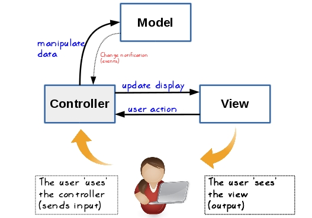

# MIXmate Dokumentation

## Ablauf

1. Cocktail wird ausgewählt 
2. Über Datenbank werden die Zutaten ausgelesen
3. Aus der Datenbank wird sowohl die Pumpenzuordnung für die einzelnen Zutaten als auch die Kalibrierung der Pumpen ausgelesen. Die Kalibrierung der Pumpen enthält, wie viel Flüssigkeit die Pumpe pro Sekunde hinauspumpt.
5. Für die Pumpe der ersten Zutat wird der Abstand aus der Datenbank geladen, um dies dem Arduino über I2C weiterzugeben
6. Es wird immer wieder über I2C der Status des Schlittens abgefragt
7. Senden der Zeit und der Pumpennummer für die erste Zutat über I2C
8. danach kommt die nächste Zutat und es wird für diese Schritt 3-7 wiederholt

## Statuscodes

Bei jeder Statusabfrage - **CMD_STATUS = 2** - I2C bekommt man folgende Nachrichten:
Statusabfrage hat 5 Bytes.

- _busy_: Mixer bzw. Pumpe ist gerade beschäftigt (1 Byte)
- _Belegung Förderband_: Glas ist auf Förderband. Auch wenn ich vor Pumpe stehe, kontrollieren, ob Glas noch auf Förderband ist(1 Byte)
- _Ist-Position Schlitten_: Wo fährt Schlitten zu Pumpe --> Überprüfung,ist und soll Position von Schlitten (2 Bytes)
- _Homeing_: OK or NOK --> Abfrage, ob Schlitten gehomed ist. Bei jedem neuen Getränk nachfragen, ob Schlitten gehomed ist (1 Byte)

### Fehlercodes und Fehlerfälle

- _Kollisionserkennung_: Schlitten erkennt Kollision 
- _Pumpe steckt_
- _Glas heruntergefallen_
- _Schlitten klemmt_
- _evtl. Flasche ist leer_

## MVC Ablauf

MIXmate/
│
├── app.py                          # Startpunkt des Programms
│
├── View/
│   └── console_view.py             # CLI oder GUI-View
│
├── Controller/
│   └── mix_controller.py           # Koordiniert Mix-Vorgang + Statusabfragen
│
├── Services/                       # Business-Logic (= dein "Logic"-Ordner)
│   ├── mix_engine.py               # enthält die Mix-Algorithmen
│   ├── status_service.py           # verwaltet Status der Maschine
│   └── recipe_service.py           # lädt/validiert Rezepte
│
├── Hardware/                       # direkte Hardware-Ansteuerung
│   ├── i2c_adapter.py              # Low-Level I2C Zugriff
│   └── pump_driver.py              # Pumpensteuerung (ruft I2C an)
│
├── Model/
│   ├── cocktail.py                 # Cocktail-Datenmodell
│   ├── ingredient.py               # Zutatenmodell
│   └── database.py                 # Datenbankzugriff (SQLite etc.)
│
└── Database/
    └── mixmate.db                  # tatsächliche SQLite-DB

# Admin-Bereich: Aufgaben und Ablauf (MVC)

Dieser Abschnitt beschreibt, was im Admin-Bereich passiert und welche Verantwortung die einzelnen Klassen übernehmen.

---

## AdminView (View)

Der `AdminView` ist die Konsolen-Ansicht für Admin-Funktionen. Er macht nur Benutzer-Interaktion:

- Menüs anzeigen (`print`)
- Benutzereingaben lesen (`input`)
- Controller-Methoden aufrufen
- Ergebnisse und Fehler ausgeben

### AdminView.run()

**Was passiert:**
1. Das Admin-Hauptmenü wird angezeigt.
2. Der Benutzer wählt eine Funktion aus.
3. Je nach Auswahl wird in ein Untermenü gesprungen:
   - Zutaten verwalten
   - Cocktails verwalten
   - Pumpen verwalten
   - Zurück

**Outcome:**
- Der Benutzer kann im Admin-Bereich navigieren.

### AdminView.ingredients_menu()

**Was passiert:**
- Menü für die Tabelle `ingredients`.

**Optionen:**
1. **Anzeigen**
   - `admin_controller.list_ingredients()` wird aufgerufen.
   - Der View gibt alle Zutaten als Liste aus: `ingredient_id : name`.
2. **Hinzufügen**
   - Name wird abgefragt.
   - `admin_controller.add_ingredient(name)` wird aufgerufen.
   - Neue Zeile wird in `ingredients` gespeichert.
3. **Umbenennen**
   - `ingredient_id` und `new_name` werden abgefragt.
   - `admin_controller.rename_ingredient(ingredient_id, new_name)` wird aufgerufen.
   - Der Name wird in `ingredients` geändert (ID bleibt gleich).

**Outcome:**
- Zutaten können angezeigt, ergänzt und umbenannt werden.

### AdminView.cocktails_menu()

**Was passiert:**
- Menü für die Tabelle `cocktails` und Einstieg in die Rezeptpflege (`cocktail_ingredients`).

**Optionen:**
1. **Anzeigen**
   - `admin_controller.list_cocktails()` wird aufgerufen.
   - Der View gibt alle Cocktails aus: `cocktail_id : cocktail_name`.
2. **Hinzufügen**
   - Name wird abgefragt.
   - `admin_controller.add_cocktail(name)` wird aufgerufen.
   - Neue Zeile wird in `cocktails` gespeichert.
   - Optional wird die neue `cocktail_id` angezeigt.
3. **Löschen**
   - `cocktail_id` wird abgefragt.
   - `admin_controller.delete_cocktail(cocktail_id)` wird aufgerufen.
   - Dabei werden zuerst passende Rezeptzeilen aus `cocktail_ingredients` gelöscht und danach der Cocktail aus `cocktails`.
4. **Rezept bearbeiten**
   - `cocktail_id` wird abgefragt.
   - `recipes_menu(cocktail_id)` wird geöffnet.

**Outcome:**
- Cocktails können verwaltet werden und für jeden Cocktail kann das Rezept bearbeitet werden.

### AdminView.recipes_menu(cocktail_id)

Dieses Menü bearbeitet das Rezept eines Cocktails (Tabelle `cocktail_ingredients`).

**Optionen:**
1. **Rezept anzeigen**
   - `admin_controller.get_recipe(cocktail_id)` wird aufgerufen.
   - Ausgabe der Zutaten in der Reihenfolge `order_index`.
2. **Zutat hinzufügen**
   - Zutatenliste wird angezeigt (über `admin_controller.list_ingredients()`).
   - Benutzer wählt `ingredient_id`.
   - Benutzer gibt `amount_ml` und `order_index` ein.
   - `admin_controller.add_recipe_item(cocktail_id, ingredient_id, amount_ml, order_index)` wird aufgerufen.
3. **Zutat ändern**
   - Benutzer gibt `ingredient_id`, neue `amount_ml` und neuen `order_index` ein.
   - `admin_controller.update_recipe_item(...)` wird aufgerufen.
4. **Zutat entfernen**
   - Benutzer gibt `ingredient_id` ein.
   - `admin_controller.delete_recipe_item(cocktail_id, ingredient_id)` wird aufgerufen.

**Outcome:**
- Das Rezept (`cocktail_ingredients`) kann vollständig gepflegt werden (Menge + Reihenfolge).

### AdminView.pumps_menu()

Dieses Menü verwaltet Pumpen-Stammdaten und Zuweisungen.

**Optionen:**
1. **Anzeigen**
   - `pump_controller.list_pumps()` wird aufgerufen.
   - Ausgabe: `pump_number`, `ingredient_id`, `flow_rate_ml_s`, `position_steps`.
2. **Neue Pumpe anlegen**
   - `admin_controller.add_pump(pump_number)` wird aufgerufen.
   - Neue Zeile wird in `pumps` angelegt.
3. **Pumpe löschen**
   - `admin_controller.delete_pump(pump_number)` wird aufgerufen.
   - Zeile wird aus `pumps` gelöscht.
4. **Zutat zuweisen**
   - Zutatenliste wird angezeigt.
   - Benutzer wählt `ingredient_id`.
   - `pump_controller.assign_ingredient(pump_number, ingredient_id)` wird aufgerufen.
   - `pumps.ingredient_id` wird geändert.

**Outcome:**
- Pumpen können angezeigt werden, und die Zutat pro Pumpe kann umgesteckt werden.

---

## AdminController (Controller)

Der `AdminController` ist die Logik-Schicht zwischen View und Model:

- keine `input()` / `print()` Logik
- keine Hardware-Ansteuerung
- ruft Model-Methoden auf und gibt Ergebnisse weiter

### Zutaten
- `list_ingredients()`
  - ruft `IngredientModel.get_all_ingredients()` auf
  - Outcome: Liste aller Zutaten
- `add_ingredient(name)`
  - ruft `IngredientModel.add_ingredient(name)` auf
  - Outcome: neue Zutat in `ingredients`
- `rename_ingredient(ingredient_id, new_name)`
  - ruft `IngredientModel.rename_ingredient(...)` auf
  - Outcome: Name geändert

### Cocktails
- `list_cocktails()`
  - ruft `CocktailModel.get_all_cocktails()` auf
  - Outcome: Liste aller Cocktails
- `add_cocktail(cocktail_name)`
  - ruft `CocktailModel.add_cocktail(cocktail_name)` auf
  - Outcome: neuer Cocktail in `cocktails`
- `delete_cocktail(cocktail_id)`
  - ruft `CocktailModel.delete_cocktail(cocktail_id)` auf
  - Outcome: Cocktail + Rezept gelöscht

### Rezepte (`cocktail_ingredients`)
- `get_recipe(cocktail_id)`
  - ruft `CocktailModel.get_recipe(cocktail_id)` auf
  - Outcome: Rezeptliste sortiert nach `order_index`
- `add_recipe_item(...)`
  - ruft `CocktailModel.add_recipe_item(...)` auf
  - Outcome: neue Rezeptzeile
- `update_recipe_item(...)`
  - ruft `CocktailModel.update_recipe_item(...)` auf
  - Outcome: Rezeptzeile aktualisiert
- `delete_recipe_item(cocktail_id, ingredient_id)`
  - ruft `CocktailModel.delete_recipe_item(...)` auf
  - Outcome: Rezeptzeile entfernt

---

## IngredientModel (Model)

Das `IngredientModel` macht ausschließlich Datenbankzugriffe auf `ingredients`.

### IngredientModel.get_all_ingredients()
- führt `SELECT ingredient_id, name FROM ingredients ORDER BY ingredient_id` aus
- wandelt die Rows in eine Liste von Dictionaries um

**Outcome:**
- Liste aller Zutaten für Anzeige und Auswahl.

### IngredientModel.add_ingredient(name)
- validiert, dass `name` nicht leer ist
- führt `INSERT INTO ingredients (name) VALUES (?)` aus
- `commit()` speichert die Änderung

**Outcome:**
- neue Zutat ist in der Datenbank vorhanden.

### IngredientModel.rename_ingredient(ingredient_id, new_name)
- validiert, dass `new_name` nicht leer ist
- führt `UPDATE ingredients SET name=? WHERE ingredient_id=?` aus
- `commit()` speichert die Änderung
- wenn `rowcount == 0`: ID existiert nicht → Fehler

**Outcome:**
- Zutat wird umbenannt, alle Referenzen bleiben gültig (IDs ändern sich nicht).

---

## CocktailModel (Model)

Das `CocktailModel` verwaltet:
- `cocktails` (Cocktail-Stammdaten)
- `cocktail_ingredients` (Rezepte)

### CocktailModel.get_all_cocktails()
- führt `SELECT cocktail_id, cocktail_name FROM cocktails ORDER BY cocktail_id` aus
- gibt Liste von Dictionaries zurück

**Outcome:**
- Liste aller Cocktails für Anzeige und Auswahl.

### CocktailModel.add_cocktail(cocktail_name)
- validiert, dass Name nicht leer ist
- führt `INSERT INTO cocktails (cocktail_name) VALUES (?)` aus
- `commit()` speichert
- optional: `lastrowid` wird zurückgegeben

**Outcome:**
- neuer Cocktail existiert (ID wird nicht nachgezogen und kann Lücken haben).

### CocktailModel.delete_cocktail(cocktail_id)
- löscht zuerst alle Rezeptzeilen:
  - `DELETE FROM cocktail_ingredients WHERE cocktail_id=?`
- löscht danach den Cocktail:
  - `DELETE FROM cocktails WHERE cocktail_id=?`
- `commit()` speichert

**Outcome:**
- Cocktail und sein komplettes Rezept sind entfernt.

### CocktailModel.get_recipe(cocktail_id)
- liest alle Rezeptzeilen aus `cocktail_ingredients`
- joined `ingredients`, damit `ingredient_name` direkt mitkommt
- sortiert zwingend nach `order_index` (`ORDER BY order_index`)

**Outcome:**
- Rezept kommt in der gewünschten Reihenfolge zurück (erste Zutat, zweite Zutat, ...).

### CocktailModel.add_recipe_item(...)
- fügt eine neue Zeile in `cocktail_ingredients` ein:
  - `cocktail_id`, `ingredient_id`, `amount_ml`, `order_index`

**Outcome:**
- Zutat ist Teil des Cocktails (Rezept wurde erweitert).

### CocktailModel.update_recipe_item(...)
- aktualisiert `amount_ml` und `order_index` einer Rezeptzeile

**Outcome:**
- Menge und/oder Reihenfolge sind geändert.

### CocktailModel.delete_recipe_item(cocktail_id, ingredient_id)
- löscht eine Rezeptzeile aus `cocktail_ingredients`

**Outcome:**
- Zutat ist aus dem Rezept entfernt.

---

## Warum `ORDER BY order_index` nötig ist

SQL garantiert keine Reihenfolge ohne Sortierung.

- ohne `ORDER BY` kann SQLite Zutaten in beliebiger Reihenfolge liefern
- mit `ORDER BY order_index` kommt die Reihenfolge so zurück, wie sie im Rezept festgelegt wurde

**Outcome:**
- Die MixEngine verarbeitet Zutaten wirklich in der gewünschten Reihenfolge.
